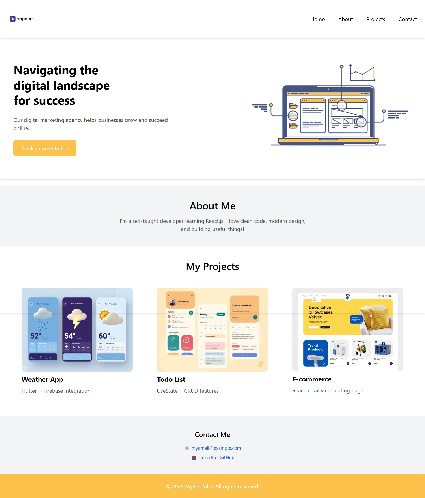

# 💼 Simple React Portfolio Website

This is a simple **React-based portfolio website** built to showcase personal projects, contact details, and a short bio. It serves as a hands-on project to help learn and practice key React concepts, routing, component structure, and styling using Tailwind CSS.

---

## 🚀 Features

- **Reusable components**: Navbar, Footer, Contact, Projects, etc.
- **Dynamic routing** for different pages (Home, About, Projects, Contact)
- **Responsive layout** using Tailwind CSS
- **Scroll-aware navbar** that hides and reveals based on user scrolling
- Project cards that include image, title, and description

---

## 🛠 Tech Stack

- **React.js**
- **React Router**
- **Tailwind CSS**

---

